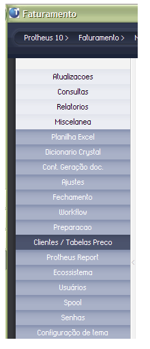

INSTALAÇÃO

Adicionar no menu Miscelânea do modulo

Deixar o nome do fonte como NTGCLITPRC.prw apenas.

Após os cadastros serem importados do servidor, pelo processo do Controle de Lojas, proceder com as preparações executando a rotina.

OPERAÇÕES

I ­ Clientes a vista / cartão e que o cadastro atenda ao SPED Quanto a questão de o cliente ser a vista ou cartão, considerei que no cadastro do cliente é informada a condição de pagamento padrão utilizada por ele, presumindo haver condições de pagamento já cadastradas para cada 
situação.

1) Clicar no botão "Parâmetros" para informar as condições de pagamento a vista e cartões. Poderá informar mais de uma condição separado por virgula, e
sem espaços. Como não vi a situação dos cadastros preferi separar uma pergunta
para cada tipo.

2) Clicar no botão "Analisar" e confirmar a pergunta "Iniciar Análise?". O
cadastro de clientes será analisado conforme exigência de preenchimento dos
campos para o SPED e as condições de pagamento a vista forem iguais as
definidas no passo 1.

Aprovados ­ Flag Verde,

Não aprovados Flag Vermelho

3) Clicar no botão "Processar" para excluir todos os clientes não aprovados.

4) O sistema irá fazer uma validação se ha movimentacões do cliente, em
titulos, notas fiscais, e outras para verificar se será permitido excluir.

­­­­­­­­­­­­­­­­­­­­­­­­­­­­­­­­­­­
II ­ Vincular tabelas de preco para consumidor final e CNPJ

O critério utilizado para identificação do cliente como consumidor final e
CNPJ foi pelo campo A1_PESSOA, se F ­ Física, J ­ Jurídica.

1) Clicar no botão "Parâmetros", informar as individualmente as tabelas para
consumidor final e pessoa jurídica.

2) Clicar no botão "Vincular" e confirmar a pergunta "Iniciar Vinculacão?".
Será preenchida a coluna tabela Definida.
